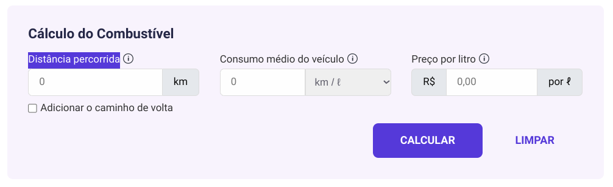
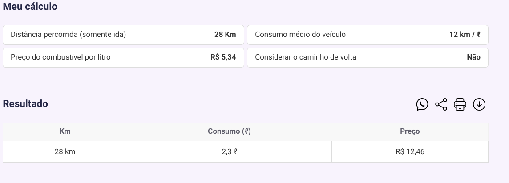

## Mapa logico do programa

1 - Vamos ter um programa que faz o calculo deste de quanto a pessoa teria que gastar de gasolina para ir e voltar de uma viajem.

2 - Vamos ter algumas caracteristicas como:
  - Consumo médio do veículo
  - Preço por litro
  - Distância percorrida
3 - Ao final teremos que informa o quanto ele tera que gastar com essa viagem de gasolina.

## Mapa de design do programa

- cor primaria: #6115DD